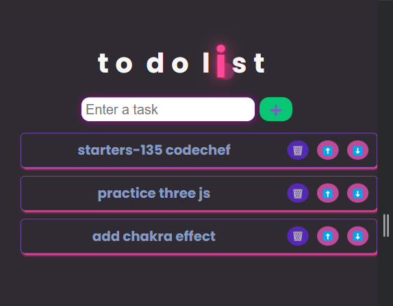

# Task Tracker

A ToDo List application designed with an intuitive and visually appealing user interface (UI) to help users efficiently manage their tasks and improve productivity. The application focuses on providing a seamless user experience with features like task categorization and priority settings, all wrapped in a clean and modern design.

## Table of Contents

    you have to run npm init to generate package.json file then run npm install to install dependencies.

    This will store all the information in localStorage so you can close this website and it will still save your tasks

##



```bash
This was a practice project which I made for a better understanding of react.js
```


